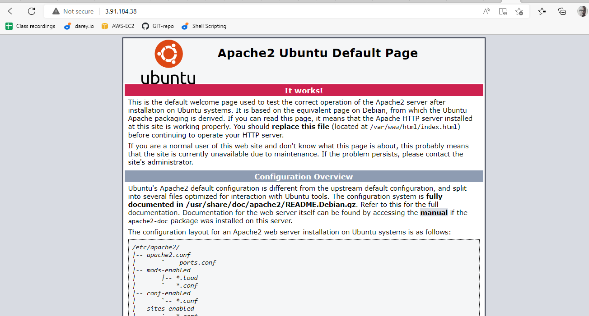

# LOAD BALANCER SOLUTION WITH APACHE

* Prerequisites from project 7


1. Two RHEL8 Web Servers

2. One MySQL DB Server (based on Ubuntu 20.04)

3. One RHEL8 NFS server

# Task
Deploy and configure an Apache Load Balancer for Tooling Website solution on a separate Ubuntu EC2 intance. Make sure that users can be served by Web servers through the Load Balancer.


To configure Apache As A Load Balancer

1. I created an Ubuntu Server 20.04 EC2 instance and named it **Project-8-apache-lb**, so my EC2 list looks like this:


2. Opened ***TCP port 80*** on Project-8-apache-lb by creating an Inbound Rule in Security Group.


3. Installed Apache Load Balancer on ***Project-8-apache-lb*** server and configured it to point traffic coming to LB to the three Web Servers from my project 7:

```
#Install apache2
sudo apt update
sudo apt install apache2 -y
sudo apt-get install libxml2-dev

#Enable following modules:
sudo a2enmod rewrite
sudo a2enmod proxy
sudo a2enmod proxy_balancer
sudo a2enmod proxy_http
sudo a2enmod headers
sudo a2enmod lbmethod_bytraffic

#Restart apache2 service
sudo systemctl restart apache2

```

* Verified apache2 is up and running


`sudo systemctl status apache2`


* This is now visible from the browser using the public IP of the Apache lb




* Configured load balancing with the following in text editor


`sudo vi /etc/apache2/sites-available/000-default.conf`

```

#Add this configuration into this section <VirtualHost *:80>  </VirtualHost>

<Proxy "balancer://mycluster">
               BalancerMember http://<WebServer1-Private-IP-Address>:80 loadfactor=5 timeout=1
               BalancerMember http://<WebServer2-Private-IP-Address>:80 loadfactor=5 timeout=1
               BalancerMember http://<WebServer3-Private-IP-Address>:80 loadfactor=5 timeout=1
               ProxySet lbmethod=bytraffic
               # ProxySet lbmethod=byrequests
        </Proxy>

        ProxyPreserveHost On
        ProxyPass / balancer://mycluster/
        ProxyPassReverse / balancer://mycluster/

```


* Restart ***apache server***

`sudo systemctl restart apache2`


* To verify that my configuration works, I did try to access my LB’s public IP address from my browser with:


http://<Load-Balancer-Public-IP-Address-or-Public-DNS-Name>/index.php


http://http://3.91.184.38/index.php


***End of project***


